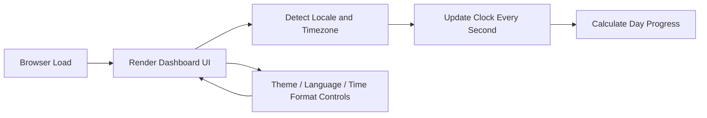

# AI 開發實作熱身：動態時間儀表板

本實作是首次嘗試應用 AI 開發純前端技術完成一個具互動感的單頁式時間儀表板。

作品以 `HTML5`、`CSS3` 與原生 `JavaScript` 建構，整合即時數位時鐘、今日時間流逝進度、時區偵測、多主題切換、雙語介面與滑鼠光暈互動效果。重點不是複雜框架，而是練習前端排版、DOM 操作、時間邏輯與使用者介面狀態切換。

🔗 [**Live Demo**](https://dec591nyc.github.io/First-AI-Dev-Practice/)

---

## 專案 Infography

| 面向 | 內容 |
| --- | --- |
| 展示主題 | 動態數位時鐘與時間資訊儀表板 |
| 核心技術 | HTML5、CSS3、原生 JavaScript ES6 |
| 互動重點 | 主題切換、語系切換、12H / 24H 顯示切換、滑鼠光暈追蹤、金句刷新 |
| 時間邏輯 | 即時時間更新、日期格式切換、時區自動偵測、今日進度百分比 |
| 部署方式 | GitHub Pages 靜態網站部署 |



---

## 核心功能

- **多主題面板切換**：提供 Olive、Orange、Slate、Beige 四種視覺風格，練習 CSS 變數與主題狀態管理。
- **即時數位時鐘**：每秒更新時、分、秒，並支援 12 小時制與 24 小時制切換。
- **今日時間流逝進度**：將一天已過去的比例轉換為百分比與進度條，讓時間變得可視化。
- **時區自動偵測**：讀取瀏覽器端時區資訊，顯示目前 UTC offset 與時區名稱。
- **雙語介面**：支援英文與繁體中文切換，包含標籤、日期與提示文字。
- **滑鼠光暈互動**：卡片背景會依照滑鼠位置產生局部光影變化，提升頁面互動感。
- **隨機金句刷新**：透過 JavaScript 陣列與事件監聽，實作前端資料切換練習。

---

## 本機執行

本專案是純前端靜態網頁，不需要安裝套件或執行建置流程。

1. 直接開啟 `index.html`。
2. 或使用 Python 啟動本機靜態伺服器：

```bash
python -m http.server 8000
```

接著在瀏覽器開啟：

```text
http://localhost:8000
```

---

## 目錄結構

```text
First-AI-Dev-Practice/
├── index.html
└── README.md
```

`index.html` 同時包含 HTML 架構、CSS 樣式與 JavaScript 互動邏輯。

---

## 技術重點

- **HTML5**：建立語意化頁面結構與控制項。
- **CSS3**：使用 CSS variables、Flexbox、漸層背景、backdrop-filter 與 responsive layout。
- **JavaScript ES6**：處理 DOM 更新、Date API、setInterval、事件監聽與 UI 狀態切換。
- **Google Fonts**：使用 Outfit、Plus Jakarta Sans 與 Share Tech Mono 強化儀表板視覺風格。

---

## 開發收穫

這份作業主要用來確認前端開發需求是否能透過 AI 以盡少的 Token 消耗完成工作任務：

- 單頁式版面配置
- 使用者互動與狀態切換
- 時間與日期資料格式化
- CSS 主題系統
- 靜態網站部署到 GitHub Pages
